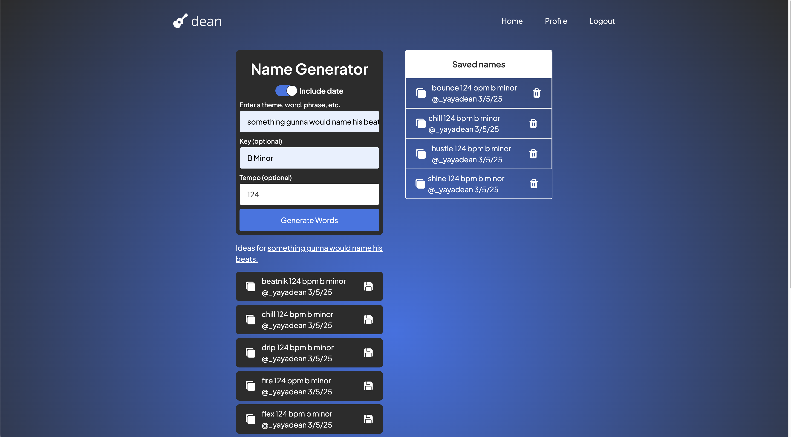

# Name Generator

Welcome to **Name Generator** – the ultimate tool for music producers who are tired of boring file names for their beats and melodies.

## Overview

Name Generator is designed specifically for music producers. If you’ve ever struggled with naming your DAW files, this tool is here to transform that mundane process into a fun, creative experience. Simply add your Instagram handle, optional key and tempo, and a word or phrase, and let ChatGPT provide you with **10 formatted loop/beat name ideas** that are as 🔥🔥 as your latest drop!



Think of it as your personal DJ for file names – spinning out ideas that match your style and vibe.

## Features

- **Instagram Handle Integration:** Showcase your brand by including your Instagram handle in every generated name.
- **Optional Keys & Tempos:** Add extra details to tailor the name to the mood or technical specifics of your beat.
- **ChatGPT Powered Creativity:** Input a word or phrase, and get back 10 killer name ideas that blend your input with AI-generated magic.
- **Easy-to-Use Interface:** Built with a sleek, modern design to keep your creative flow uninterrupted.

## Tech Stack

- **Next.js:** For fast, server-side rendering and seamless routing.
- **React:** To build dynamic, interactive user interfaces.
- **TypeScript:** Bringing type safety and enhanced developer experience.
- **Tailwind CSS:** For utility-first styling that keeps your UI fresh and responsive.
- **ChatGPT:** The secret sauce powering the creative name generation.

## Getting Started

### Prerequisites

- [Node.js](https://nodejs.org/) (v14 or above)
- [npm](https://www.npmjs.com/) or [yarn](https://yarnpkg.com/)

### Installation

1. Clone the repository:

```bash
git clone <https://github.com/petehod/loop-name-generator.git>
```

2. Install dependencies:

```bash
	npm install
```

3. Run the development server

```bash
npm run dev
```

Open [http://localhost:3000](http://localhost:3000/) in your browser to see the app in action!

### **Usage**

1. **Enter Your Details:** Fill in your Instagram handle, select your desired key and tempo (if any), and enter a word or phrase that inspires you.

2. **Generate Names:** Hit the generate button and watch as ChatGPT whips up 10 fresh file name ideas for your beat or melody.

3. **Pick Your Favorite:** Scroll through the suggestions, pick the one that resonates with your vibe.
